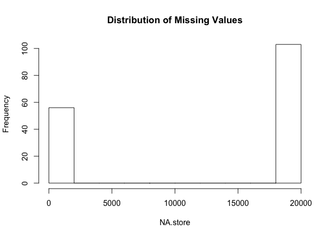
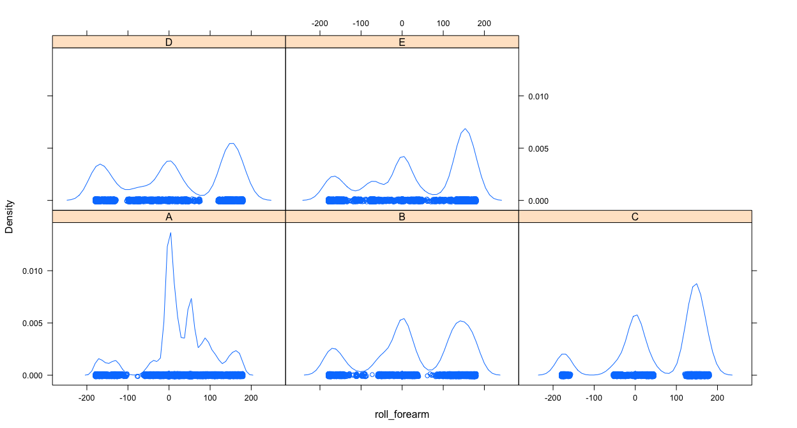
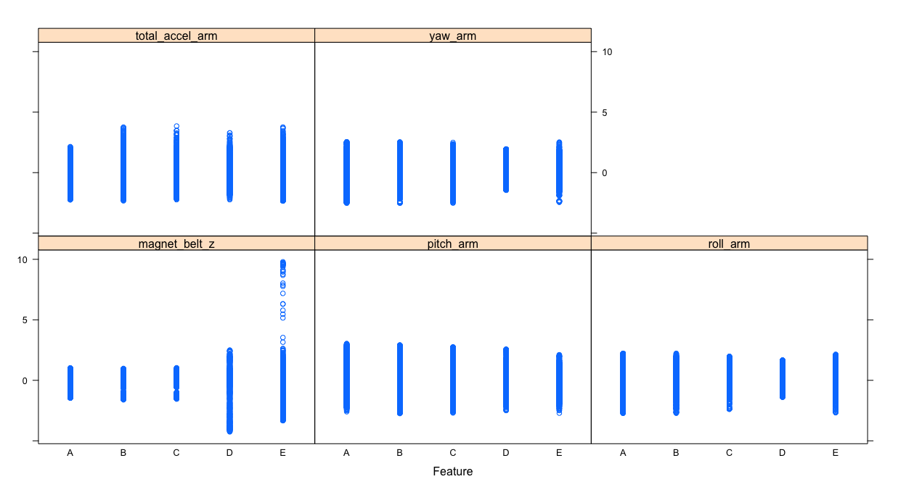

# Quantifying Exercise Quality
Christopher Castle  
Note: I'm including links to the github repo and gh-pages link for this project.
Github repo: https://github.com/89million/PML-course-project
gh-pages url: http://89million.github.io/PML-course-project-html/


This is the course project for Coursera's Practical Machine Learning class. The goal of the project is to create a machine learning algorithm which can predict the quality [on a scale of A-E] of how a barbell lift exercise was done using measurements from accelerometers on the belt, forearm, arm and dumbell of 6 participants.

We'll start by loading the packages we'll need and the data we'll be using into R. The source for this data is available here; http://groupware.les.inf.puc-rio.br/har


```r
library(caret)
library(randomForest)
library(lattice)
```

```r
# read train and test csv
train = read.csv("./data/pml-training.csv")
test = read.csv("./data/pml-testing.csv")
dim(train)
```

```
## [1] 19622   160
```

```r
# the X variable looks like a row counter
length(unique(train$X))
```

```
## [1] 19622
```

```r
train$X <- NULL
test$X <- NULL
```

#Cleaning the Data

Let's look at the classes of our variables.


```r
table(sapply(train, class))
```

```
## 
##  factor integer numeric 
##      37      34      88
```

```r
head(summary(train$kurtosis_roll_belt))
```

```
##             #DIV/0! -1.908453 -0.016850 -0.021024 -0.025513 
##     19216        10         2         1         1         1
```

R seems to have interpreted a number of the measurements in our data as factors. There are a handful of ways to fix this but we'll loop over the data frame to convert each factor to numeric type.


```r
# convert factor variables to numeric, excluding the final response var
for (i in (seq_len(dim(train)[2])-1) ) {
      if (class(train[,i]) == "factor"){
            train[,i] <- as.numeric(as.character(train[,i]))}}
```

Now let's see how many missing values there are. We'll look at this as a ratio of NA values over the total number of cells in our data frame.


```r
sum(is.na(train)) / (dim(train)[1] * dim(train)[2])
```

```
## [1] 0.635908
```

Quite a bit of data is missing. Let's look at a sum of the total missing data by column to see how it's distributed. 

```r
# there are a lot of NA's, many entries are "#DIV/0!"
# find vars that have a lot of data relative to total rows
NA.store <- sapply(train, function(x) sum(is.na(x)))
hist(NA.store, main="Distribution of Missing Values")
```

\

We can clearly see that the missing values are not distributed uniformly across the variables. Some variables are almost entirely missing any measurement while others are nearly complete. Rather than trying to impute any values to our missing data we'll remove the variables that have over 95% NA values. 


```r
# store the names of variables with over 95% NA values
junk <- NA.store[NA.store / dim(train)[1] > .95]
junk.names <- names(junk)

# remove NA filled variables from train and test
train <- train[,-which(names(train) %in% junk.names)]
test <- test[,-which(names(test) %in% junk.names)]
table(sapply(train, function(x) sum(is.na(x)))) # verify NA heavy vars are deleted
```

```
## 
##  0 
## 56
```

#Exploratory Data Anaysis

Let's do some EDA to see how variables are different between classes. The variables with a lot of variation between classes will be better predictors. There are 55 possible predictors so we'll look at just a few for this report.  


```r
# See how density changes by class for an example variable
densityplot(~ roll_forearm | classe, train)
```

\

```r
# feature plot to see variation among classe for a few variables. Scale them first.    
featurePlot(scale(train[,16:20]), train$classe)
```

\

At first glance these plots look acceptable. If we think reducing some predictors will improve our model we may come back to this method to help us guide our dimensional reduction but for the moment we'll move on. 

#Training the Model

We'll use the caret package to split our data into new train and test subsets of the original training data. The new training set will consist of 60% of the original data, randomly sampled. The remainder will be our new test set. Then we'll build a randomForest model and train it using 10-fold cross validation. Choosing 10 folds should be sufficient to prevent model over-fitting without increasing the variance too much as is possible with leave-one-out CV. 


```r
# partition new training and test data
set.seed(10)
inTrain <- createDataPartition(train$classe, p=.6, list=FALSE)
xTrain <- train[inTrain,]
xTest <- train[-inTrain,]

# use 10 fold cross validation to train the model
fitControl <- trainControl(
      method = "cv",
      number = 10)

# fit the model to xTrain subset
set.seed(20)
fit <- train(classe ~., method='rf', ntree=100, trControl=fitControl, data=xTrain)
```

#Model Results

Let's see how the model performed. One of the benefits of the randomForest algorithm is an accurate estimate for the error rate using bootstrap samples. 


```r
fit$finalModel
```

```
## 
## Call:
##  randomForest(x = x, y = y, ntree = 100, mtry = param$mtry) 
##                Type of random forest: classification
##                      Number of trees: 100
## No. of variables tried at each split: 28
## 
##         OOB estimate of  error rate: 0.11%
## Confusion matrix:
##      A    B    C    D    E  class.error
## A 3348    0    0    0    0 0.0000000000
## B    1 2275    3    0    0 0.0017551558
## C    0    3 2050    1    0 0.0019474197
## D    0    0    1 1927    2 0.0015544041
## E    0    0    0    2 2163 0.0009237875
```

The predicted accuracy of this model is over 99% according to the Out-of-Bag error estimate which is just a fraction of 1%. We'll use our test subset to verify the accuracy. 


```r
# predict values on xTest subset
preds <- predict(fit$finalModel, newdata = xTest)
cMat <- confusionMatrix(preds, xTest$classe)
cMat
```

```
## Confusion Matrix and Statistics
## 
##           Reference
## Prediction    A    B    C    D    E
##          A 2232    0    0    0    0
##          B    0 1516    3    0    0
##          C    0    2 1362    2    0
##          D    0    0    3 1284    0
##          E    0    0    0    0 1442
## 
## Overall Statistics
##                                           
##                Accuracy : 0.9987          
##                  95% CI : (0.9977, 0.9994)
##     No Information Rate : 0.2845          
##     P-Value [Acc > NIR] : < 2.2e-16       
##                                           
##                   Kappa : 0.9984          
##  Mcnemar's Test P-Value : NA              
## 
## Statistics by Class:
## 
##                      Class: A Class: B Class: C Class: D Class: E
## Sensitivity            1.0000   0.9987   0.9956   0.9984   1.0000
## Specificity            1.0000   0.9995   0.9994   0.9995   1.0000
## Pos Pred Value         1.0000   0.9980   0.9971   0.9977   1.0000
## Neg Pred Value         1.0000   0.9997   0.9991   0.9997   1.0000
## Prevalence             0.2845   0.1935   0.1744   0.1639   0.1838
## Detection Rate         0.2845   0.1932   0.1736   0.1637   0.1838
## Detection Prevalence   0.2845   0.1936   0.1741   0.1640   0.1838
## Balanced Accuracy      1.0000   0.9991   0.9975   0.9990   1.0000
```

```r
# remove scientific notation and create accuracy variables to populate below
options(scipen = 999)
acc <- round(cMat[[3]][1], 4)
lower.acc <- round(cMat[[3]][3], 4)
upper.acc <- round(cMat[[3]][4], 4)
```

This seems to confirm our original estimates. The 95% confidence interval for accuracy is between 0.9977 and 0.9994. This corresponds to an error rate of 0.0013 with an interval of 0.0023 to 0.0006.
